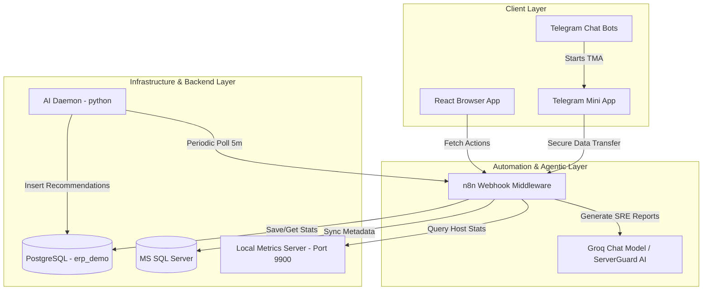

# RedCloud / RedHelp Platform Documentation

Welcome to the official developer and system administration documentation for the **RedCloud (RedHelp)** platform. This document outlines the system architecture, codebase structure, technology stack, database schemas, n8n automation workflows, and installation/deployment steps.

---

## 📖 1. Project Overview

**RedCloud** (internally branded as **RedHelp**) is a next-generation Enterprise SRE (Site Reliability Engineering) and Database Operations platform. It bridges the gap between infrastructure telemetry and actionable AI intelligence, offering real-time monitoring and chat interfaces directly in desktop browsers or embedded inside **Telegram** as a **Telegram Mini App**.

### Key Highlights
* **Comprehensive Dashboards**: Real-time overview of database nodes and server metrics.
* **Bi-Domain AI Assistant**: Split chat interface featuring a **Database AI** and a **Server & Cyber AI** running SRE analysis via n8n workflows and large language models (LLMs).
* **Automatic Recommendations**: Background daemons updating PostgreSQL with AI-generated index tunings and performance remedies.
* **Telegram Integration**: Custom commands, status grids, and instant authentication redirecting into Telegram Mini Apps.
* **Zero Mock Telemetry**: Real-time server telemetry collected on the host machine using Python's `psutil` library.

---

## 🏗️ 2. System Architecture

The RedCloud platform is divided into three tiers: **Client Layer**, **Automation & Agentic Layer**, and **Database & Daemon Layer**.



### Flow 1: User Authentication Flow
1. User logs in from React Frontend or launches the Telegram Mini App.
2. React app queries `POST /webhook/erp-auth` with operation `login` and user credentials.
3. n8n workflow receives request, queries PostgreSQL `erp_users` table, and verifies credentials.
4. If successful, user profile (email, role, needs_password_change status) is returned.

### Flow 2: Live Database Telemetry Flow
1. n8n running a recurring 1-minute interval cron pulls metadata from **MS SQL Server** (databases table counts, file sizes, active connections).
2. The metadata is upserted into **PostgreSQL** (`database_metrics` table).
3. The dashboard pages poll PostgreSQL via n8n webhooks every second to visualize real-time charts.

### Flow 3: Server Health & SRE Chat Flow
1. SRE Assistant page sends user queries to `POST /webhook/sre-chatbot`.
2. n8n queries the **Local Metrics Server** at `http://host.docker.internal:9900/metrics` for raw host resources.
3. Results are saved in PostgreSQL `metrics_history` and `security_metrics`.
4. n8n compiles telemetry logs and forwards them to a **Groq Chat Model** wrapped with **ServerGuard AI** agent instructions.
5. The chat model responds with a structural conversational dashboard status.

---

## 🛠️ 3. Technology Stack

### Frontend Client
* **Framework**: React 19 + TypeScript + Vite
* **Routing**: React Router DOM (v6) with a `/Redcloud` subpath base
* **State Management**: React Context API (`AuthContext`, `ThemeContext`, `TelegramContext`)
* **Styling**: Tailwind CSS (v3) + Vanilla CSS (Glassmorphism & animations)
* **Visualizations**: Recharts (Framer Motion enabled responsive graphs)
* **Icons**: Lucide React

### External Services & Automation
* **n8n Workflow Engine**: Hosts JSON workflows for authentication routing, telemetry sync, and chat histories.
* **LLM Engine**: Groq Chat Model integrations for ServerGuard SRE analysis.
* **Tunneling & Deployment**: Cloudflare Tunnels (`cloudflared.exe`) and Ngrok for public webhook access.

### Host Daemons & Backend Scripts
* **Local Metrics Server**: Python HTTP server running on port `9900`, using `psutil`.
* **AI Recommendation Daemon**: Python daemon running on a 5-minute loop fetching n8n AI optimizations and storing them in PostgreSQL.
* **Telegram Bots**:
  1. Node.js Bot (`redhelp-bot.js`): Uses `Telegraf` to serve the Launch button and configure bottom menu Mini App redirections.
  2. Python Bot (`bot.py`): Uses `python-telegram-bot` to offer native text menu controls alongside Mini App links.

---

## 📁 4. Codebase Directory Layout

```
RedCloud/
├── package.json                    # Node dependencies and project scripts
├── vite.config.ts                  # Vite build configuration (base: '/Redcloud')
├── tailwind.config.js              # Custom theme extensions and colors
├── .oxlintrc.json                  # Linting configurations
│
├── local_metrics_server.py         # Python CPU/RAM HTTP server on port 9900
├── ai_recommendation_daemon.py     # Python background AI db optimizer
├── bot.py                          # Python Telegram bot launcher
├── redhelp-bot.js                  # Node.js Telegram Bot (Telegraf)
│
├── user_auth_workflow.json         # n8n User Authentication Workflow JSON
├── db_metadata_workflow.json       # n8n Database Telemetry & Sync Workflow JSON
├── server_workflow.json            # n8n Server Metrics & SRE LLM Workflow JSON
│
└── src/
    ├── main.tsx                    # React Entrypoint
    ├── App.tsx                     # Error boundaries and routes
    ├── index.css                   # Global styles & Glassmorphism variables
    │
    ├── api/
    │   └── dashboard.ts            # Client API hooks matching n8n endpoints
    │
    ├── context/
    │   ├── AuthContext.tsx         # Sessions, user roles, localStorage (10m expiry)
    │   ├── TelegramContext.tsx     # Telegram WebApp injection wrapper / local mock
    │   └── ThemeContext.tsx        # Dark/Light system modes
    │
    ├── components/
    │   ├── layout/
    │   │   ├── DashboardLayout.tsx # Sidebar + Header responsive layout
    │   │   ├── Header.tsx          # Real-time clock, notifications and user profile
    │   │   ├── Sidebar.tsx         # Navigation bar links
    │   │   └── MobileNavigation.tsx
    │   └── ui/
    │       ├── AIChatInterface.tsx # Custom markdown parser & thread management (45KB)
    │       ├── PerformanceChart.tsx# Recharts graph wrapper
    │       └── ForcePasswordChangeModal.tsx
    │
    └── pages/
        ├── Landing.tsx             # Marketing landing page
        ├── Login.tsx               # Login with sliding transitions
        ├── ForgotPassword.tsx      # Recovery options
        └── Dashboard/
            ├── DashboardOverview.tsx   # Visual grid overview & PDF reports
            ├── DatabaseMonitoring.tsx  # DB nodes, largest tables, AI tuner
            ├── ServerMonitoring.tsx    # Node resources, uptime, process lists
            ├── Alerts.tsx              # Triggered incidents logs
            ├── Profile.tsx             # Password update & avatar upload
            ├── AIAssistant.tsx         # Multi-domain AI chats
            └── AuditLog.tsx            # Infrastructure user actions
```

---

## 🛢️ 5. Database Schema & Tables

RedCloud relies on a PostgreSQL database named `erp_demo` (default credentials: `postgres / postgres`). Below are the schemas expected by n8n workflows and daemons:

### 1. `erp_users`
Stores authenticated dashboard operators.
```sql
CREATE TABLE erp_users (
    id SERIAL PRIMARY KEY,
    email VARCHAR(255) UNIQUE NOT NULL,
    role VARCHAR(50) DEFAULT 'admin', -- 'admin' or 'superadmin'
    password_hash VARCHAR(255) NOT NULL,
    avatar TEXT, -- Base64 encoded string
    needs_password_change BOOLEAN DEFAULT TRUE,
    created_at TIMESTAMP DEFAULT CURRENT_TIMESTAMP
);
```

### 2. `database_metrics`
Synced periodically from MS SQL Server to represent database clusters.
```sql
CREATE TABLE database_metrics (
    name VARCHAR(100) PRIMARY KEY,
    type VARCHAR(100),
    status VARCHAR(50),
    storage VARCHAR(50),
    tables INT,
    connections VARCHAR(50),
    replication VARCHAR(100),
    backup VARCHAR(100),
    timestamp TIMESTAMP DEFAULT CURRENT_TIMESTAMP
);
```

### 3. `ai_recommendations`
Stores fresh performance insights populated by the background recommendation daemon.
```sql
CREATE TABLE ai_recommendations (
    id SERIAL PRIMARY KEY,
    database_name VARCHAR(100) NOT NULL,
    title VARCHAR(255) NOT NULL,
    impact VARCHAR(50) NOT NULL, -- 'HIGH', 'MEDIUM', 'LOW'
    recommendation TEXT NOT NULL,
    timestamp TIMESTAMP DEFAULT CURRENT_TIMESTAMP
);
```

### 4. `metrics_history`
Tracks historical CPU and RAM utilization for server health trending charts.
```sql
CREATE TABLE metrics_history (
    id VARCHAR(100) PRIMARY KEY,
    server_name VARCHAR(100) NOT NULL,
    status VARCHAR(50),
    timestamp TIMESTAMP NOT NULL,
    cpu_usage INT,
    memory_usage INT,
    disk_usage INT,
    network_rx_mb INT DEFAULT 0,
    network_tx_mb INT DEFAULT 0,
    temperature_c INT,
    uptime VARCHAR(100),
    processes INT,
    health_status VARCHAR(50),
    health_emoji VARCHAR(50),
    summary TEXT
);
```

### 5. `security_metrics`
Historical tracking of threat attempts and authentication risk scoring.
```sql
CREATE TABLE security_metrics (
    id VARCHAR(100) PRIMARY KEY,
    server_name VARCHAR(100) NOT NULL,
    timestamp TIMESTAMP NOT NULL,
    failed_logins INT DEFAULT 0,
    successful_logins INT DEFAULT 0,
    firewall_events INT DEFAULT 0,
    blocked_ips INT DEFAULT 0,
    suspicious_users INT DEFAULT 0,
    security_alerts INT DEFAULT 0,
    threat_level VARCHAR(50),
    authentication_activity INT DEFAULT 0,
    risk_score INT DEFAULT 0
);
```

### 6. `sessions` & `chat_history`
Used by the n8n Chat History endpoint to store AI conversation logs.
```sql
CREATE TABLE sessions (
    id VARCHAR(100) PRIMARY KEY, -- Session UUID / Thread ID
    title VARCHAR(255) DEFAULT 'New Chat',
    domain VARCHAR(50) NOT NULL, -- 'database' or 'infrastructure'
    is_pinned BOOLEAN DEFAULT FALSE,
    updated_at TIMESTAMP DEFAULT CURRENT_TIMESTAMP
);

CREATE TABLE chat_history (
    id SERIAL PRIMARY KEY,
    session_id VARCHAR(100) REFERENCES sessions(id) ON DELETE CASCADE,
    sender VARCHAR(10) NOT NULL, -- 'ai' or 'user'
    text TEXT NOT NULL,
    timestamp TIMESTAMP DEFAULT CURRENT_TIMESTAMP
);
```

---

## 🔀 6. n8n Automation Workflows

The application coordinates database and server fetches using three preconfigured JSON workflow templates:

### 1. User Authentication (`user_auth_workflow.json`)
* **Endpoint**: `/webhook/erp-auth`
* **Workflow Nodes**:
  - `Auth Webhook` -> Listens for incoming dashboard credentials.
  - `Route Auth Operations` -> Splits executions into paths: `login`, `create_user`, `update_avatar`, `update_password`, and `list_users`.
  - `Postgres Login Query` -> Selects rows matching the lowercase email.
  - `Verify Credentials` -> Checks matching plain-text password hashes.
  - returns detailed JSON response node.

### 2. Database Sync (`db_metadata_workflow.json`)
* **Cron Sync Loop**:
  - Triggered every minute via `Interval Trigger (1m)`.
  - Queries MS SQL Server via `mssql-get-metadata-id` Node using query:
    ```sql
    SELECT DB_NAME() AS name, 'Microsoft SQL Server' AS type, 'Online' AS status,
           CAST(SUM(size * 8.0 / 1024) AS VARCHAR) + ' MB' AS storage,
           (SELECT COUNT(*) FROM sys.tables) AS tables,
           (SELECT COUNT(*) FROM sys.dm_exec_connections) AS connections,
           'None' AS replication, 'Backup Configured' AS backup
    FROM sys.master_files WHERE database_id = DB_ID();
    ```
  - Upserts statistics into PostgreSQL `database_metrics` via `postgres-store-metadata-id` Node.
* **REST Fetch Endpoint**:
  - `/webhook/chat-history` (with `operation: 'get_db_metadata'`).
  - Fetches rows from `database_metrics` and serves them back to React dashboards.

### 3. Server Monitoring (`server_workflow.json`)
* **Endpoint**: `/webhook/sre-chatbot`
* **Workflow Nodes**:
  - `Process Question` -> Detects intent (`HEALTH_REPORT` or `SECURITY_REPORT`) and specific servers.
  - `Generate Server Telemetry` -> Triggers an HTTP Request to host local agent: `http://host.docker.internal:9900/metrics`.
  - `Store in PostgreSQL` & `Store Security Metrics` -> Commits raw node usages.
  - `Generate Report` -> Calls a LangChain agent coupled to Groq Chat Model (`groq_red` credentials).
  - Returns raw array telemetry to dashboard timers, or structural conversational SRE reports to conversational widgets.

---

## ⚙️ 7. Installation and Configuration

### Prerequisites
* **Node.js** v18+ and **npm**
* **Python** v3.10+ (with pip)
* **PostgreSQL** & **Microsoft SQL Server** local instances
* **n8n** running locally (`n8n start` on default port `5678`)

### Step 1: Environment Variables
Create a `.env.development` or `.env.production` file in the root directory:
```env
# Client Routing Configuration
VITE_N8N_NOTIFICATIONS_URL=http://localhost:5678/webhook/notifications-api
VITE_N8N_SERVER_URL=http://localhost:5678/webhook/sre-chatbot
VITE_N8N_CHAT_HISTORY_URL=http://localhost:5678/webhook/chat-history
VITE_N8N_DB_URL=http://localhost:5678/webhook/erp-chat

# Telegram Integration (for bot scripts)
TELEGRAM_BOT_TOKEN=8798642467:AAHp8zaIVus8TaDUmIvkEvBfBDndyj-jjw0
BOT_ADMIN_PASSWORD=admin123
```

### Step 2: Set up Frontend Client
1. Install node dependencies:
   ```bash
   npm install
   ```
2. Launch Vite development server:
   ```bash
   npm run dev
   ```
3. Build for production distribution:
   ```bash
   npm run build
   ```

### Step 3: Run Telemetry Metrics Server
Ensure Python dependencies are installed and start host telemetry reporter:
```bash
pip install psutil
python local_metrics_server.py
```
*Port `9900` must be accessible to n8n (for docker setups, verify `host.docker.internal` routing).*

### Step 4: Start AI Optimizer Daemon
Ensure PostgreSQL is active and run recommendation generator loop:
```bash
pip install requests psycopg2
python ai_recommendation_daemon.py
```

### Step 5: Start Telegram Bot Integrations
To start the bot interface:
```bash
# Using Node
npm install telegraf
node redhelp-bot.js

# Or using Python
pip install python-telegram-bot python-dotenv
python bot.py
```

---

## 🛡️ 8. Security & Expiry Controls
* **Short-Lived Sessions**: User tokens inside `AuthContext` expire automatically after **10 minutes** of idle time. Active click/keyboard events continuously refresh this timer.
* **Force Password Change**: Users with the `needs_password_change` flag marked `true` in PostgreSQL are restricted from viewing any dashboard page until a fresh password is submitted and updated in the system.
* **Telegram Strict Sandbox**: Bots verify the `telegram_chat_id` and restrict telemetry commands to verified entries inside `AUTHORIZED_USERS`.

---

## 📈 9. Maintenance & Troubleshooting
1. **Empty Dashboard Cards**:
   * Verify n8n workflow is activated.
   * Check connection to target SQL servers.
   * Inspect browser network logs to confirm the endpoints target correct ports.
2. **AI Chat Webhooks Return Error**:
   * Inspect n8n dashboard logging history for the LLM / Groq model connection.
   * Verify your API key holds correct permissions.
3. **Local Metrics Fail**:
   * Check terminal output of `local_metrics_server.py`.
   * Verify port `9900` isn't blocked by local firewall policies.
